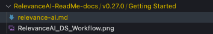
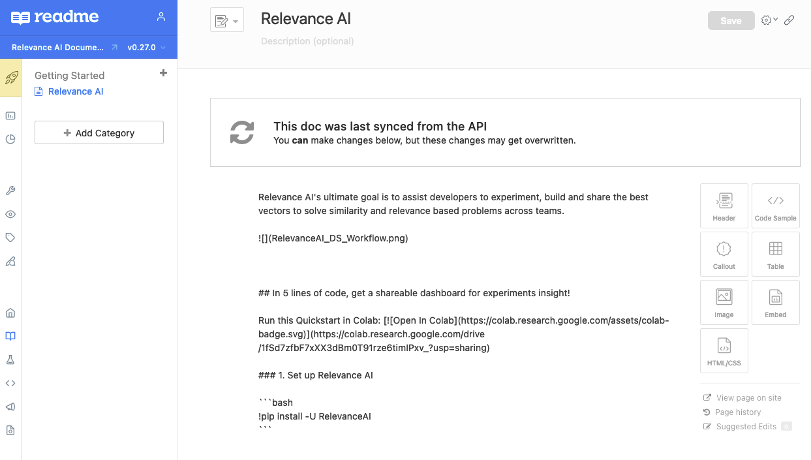

# RelevanceAI-readme-docs

This repository updates RelevanceAI's ReadMe Documentation [here](https://relevance-ai-documentation.readme.io/docs/).

## 🧠 Documentation

Migrating RelevanceAI docs from [docs.relevance.ai/docs/](https://docs.relevance.ai/docs/) to [relevance-ai-documentation.readme.io/docs/](https://relevance-ai-documentation.readme.io/docs/).


## 🛠️  Requirements

- [Node.JS ^12.x and NPM](https://docs.npmjs.com/downloading-and-installing-node-js-and-npm)
- [Python ^3.8.0](https://www.python.org/downloads/release/python-380/) - more Python version to be supported in future
- [rdme NPM client](https://www.npmjs.com/package/rdme#docs)

## 🧰 OS Supported

- Linux (Ubuntu 18.04.6 LTS (Bionic Beaver) Debian)


## 👩🏻‍💻 Getting Started with rdme Client

https://www.npmjs.com/package/rdme#docs


### Installation

```zsh
❯ npm install rdme
```

### Logging In

```zsh
❯ npx rdme login
```

You will be prompted with your username and password. Once entered, you'll be able to select a project subdomain. Upon successful login, you will be greeted with this message: Successfully logged in as {user} to the {project-subdomain} project.

### Docs

Creating a New Version

#### Interactive

```zsh
❯ npx rdme versions:create <version> | --version={project-version}
```
#### Non-interactive

If you wish to automate the process of creating a new project version, and not have the CLI prompt you for input, you can do so by supplying the necessary flags to versions:create.

For example:

```zsh
❯ npx rdme versions:create <version> | --version={project-version} --fork={version-fork} --main={boolean} --beta={boolean} --isPublic={boolean}
```

#### Syncing a Folder of Markdown Docs to ReadMe

Ensure folder structure matches the following - 






Make sure Front Matter in Markdown files - `title, slug, hidden`

```markdown
---
title: "Relevance AI"
slug: "welcome"
hidden: false
createdAt: "2022-01-10T01:31:01.336Z"
updatedAt: "2022-01-10T01:31:01.336Z"
---

```

```zsh
❯ npx rdme docs path-to-markdown-files --version={project-version}
❯ npx rdme docs ./RelevanceAI-ReadMe-docs/v0.27.0 --version=v0.27.0  
```

#### Edit a Single ReadMe Doc on Your Local Machine

```zsh
❯ npx rdme docs:edit <slug> --version={project-version}
```
#### Updating Page Slug

For now, you can only update page slugs in manually in the respective page.


## 📘 Getting Started with ReadMe Markdown

https://rdmd.readme.io/docs/getting-started


