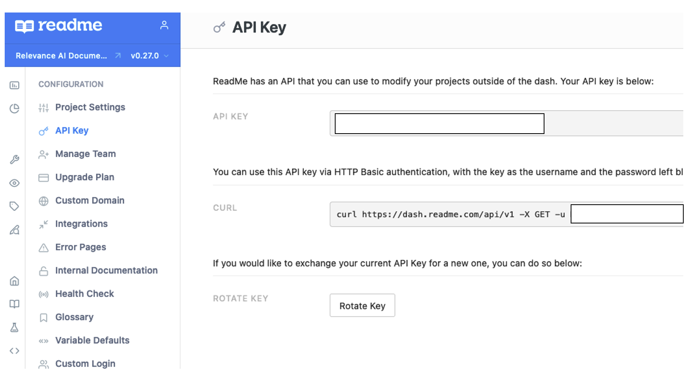
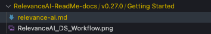
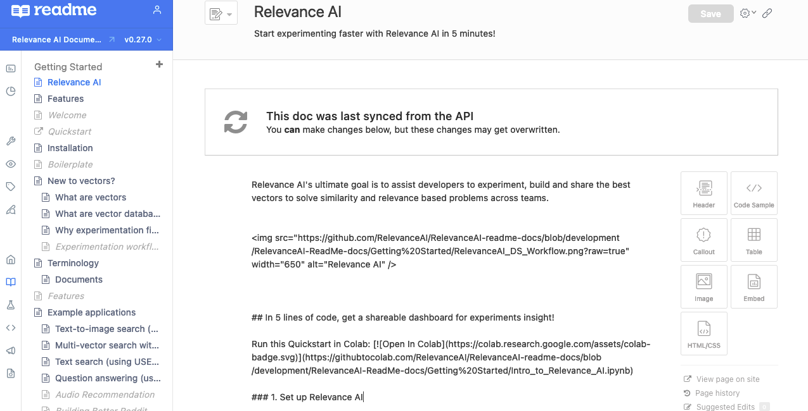
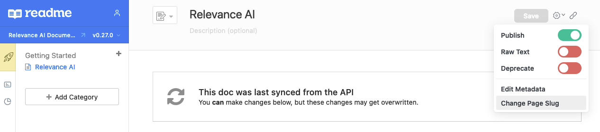

# RelevanceAI-readme-docs

This repository updates RelevanceAI's ReadMe Documentation [here](https://relevance-ai-documentation.readme.io/docs/).

## 🧠 Documentation

Migrating RelevanceAI docs from [docs.relevance.ai/v0.26.0/docs/welcome](https://docs.relevance.ai/v0.26.0/docs/welcome).
 to [docs.relevance.ai/v0.27.0/docs/welcome](https://docs.relevance.ai/v0.27.0/docs/welcome).


## 🛠️  Requirements

- [Node.JS ^12.x and NPM](https://docs.npmjs.com/downloading-and-installing-node-js-and-npm)
- [Python ^3.8.0](https://www.python.org/downloads/release/python-380/) - more Python version to be supported in future
- [rdme NPM client](https://www.npmjs.com/package/rdme#docs)

## 🧰 OS Supported

- Linux (Ubuntu 18.04.6 LTS (Bionic Beaver) Debian)


## 👩🏻‍💻 Getting Started with rdme Client

https://www.npmjs.com/package/rdme#docs


### Installation

```zsh
❯ npm install rdme
```

### Logging In

```zsh
❯ npx rdme login 
```

You will be prompted with your username and password. Once entered, you'll be able to select a project subdomain. Upon successful login, you will be greeted with this message: Successfully logged in as {user} to the {project-subdomain} project.

else export `$RELEVANCEAI_README_API_KEY` variable from ReadMe Project Configuration





```zsh
❯ export RELEVANCEAI_README_API_KEY='xxx'
```


### Asset References, Updates and Reviews

### Images

Store corresponding images in relative section. 

Append `?=raw=true` to Github asset URL.

```html


```


### Colab Notebooks

1. Store corresponding notebooks in relative section.

[](https://githubtocolab.com/RelevanceAI/RelevanceAI-readme-docs/blob/main/docs/GETTING_STARTED/Intro_to_Relevance_AI.ipynb)


2. We review notebooks using [ReviewNB](https://app.reviewnb.com/RelevanceAI/RelevanceAI-readme-docs/)

https://app.reviewnb.com/RelevanceAI/RelevanceAI-readme-docs/


### Syncing ReadMe docs
#### Syncing a Folder of Markdown Docs to ReadMe

Ensure folder structure matches the following - 






Make sure Front Matter in Markdown files - `title, slug, excerpt, hidden`

```markdown
---
title: "Relevance AI"
excerpt: "Start experimenting faster with Relevance AI in 5 minutes!"
slug: "welcome"
hidden: false
createdAt: "2022-01-10T01:31:01.336Z"
updatedAt: "2022-01-10T01:31:01.336Z"
---

```

```zsh
❯ npx rdme docs path-to-markdown-files --version={project-version} --key $RELEVANCEAI_README_API_KEY 

## eg.
❯ npx rdme docs ./docs/ --version=v0.27.0  --key $RELEVANCEAI_README_API_KEY
```

#### Edit a Single ReadMe Doc on Your Local Machine

```zsh
❯ npx rdme docs:edit <slug> --version={project-version}
```


#### Creating a New Version
##### Interactive

```zsh
❯ npx rdme versions:create <version> | --version={project-version}
```
##### Non-interactive

If you wish to automate the process of creating a new project version, and not have the CLI prompt you for input, you can do so by supplying the necessary flags to versions:create.

For example:

```zsh
❯ npx rdme versions:create <version> | --version={project-version} --fork={version-fork} --main={boolean} --beta={boolean} --isPublic={boolean}
```


#### Updating Page Slug

For now, you can only update page slugs in manually in the respective page.




## 📘 Getting Started with ReadMe Markdown

See official [docs](https://rdmd.readme.io/docs/getting-started) here for more details, else see rdmd cheatsheet [here](./rdmd.md).


### Helpful Tools

- [jqplay](https://jqplay.org/s/VTxvuAo0T2) - For crafting jq queries