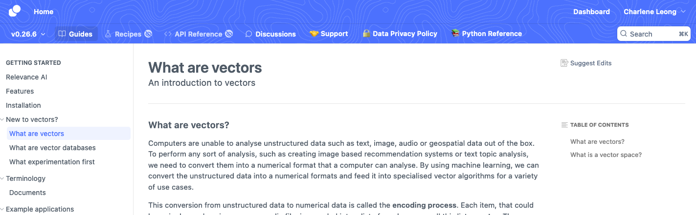
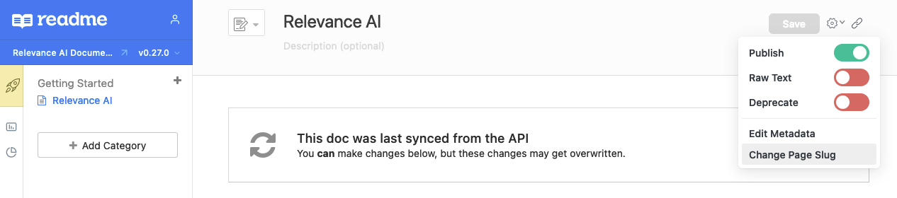
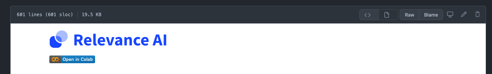
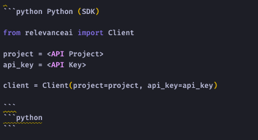
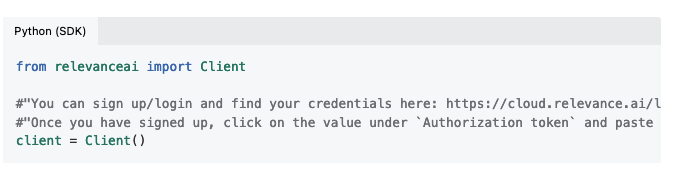
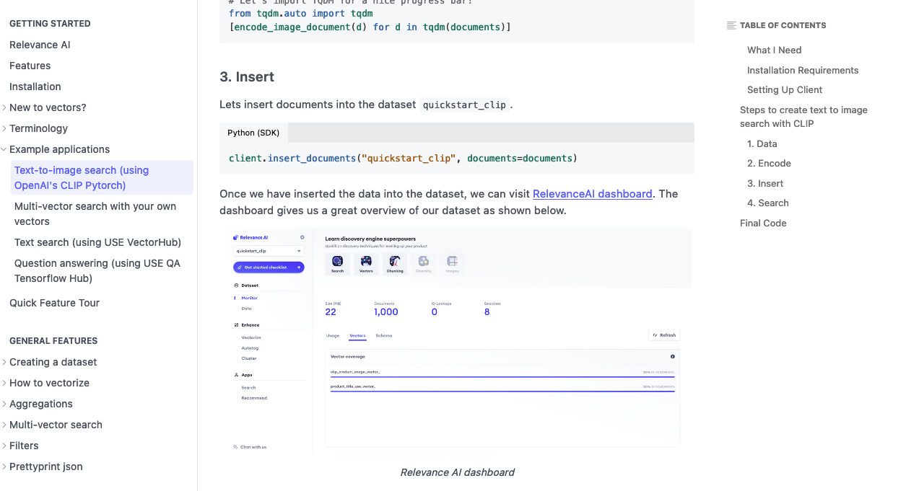
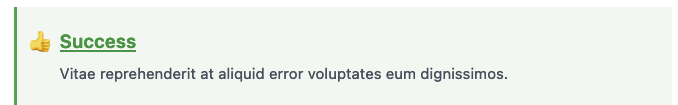

# Migration Details How-to

We aim to migrate our docs to be updated via ReadMe's API in a Git-driven manner.

Due to the fact that exported ReadMe docs are in `[block]` format as generated through manual creation vs Markdown, it becomes difficult to maintain docs in a Git-driven manner. See [here](./examples/quickstart_block_format.md) for example `[block]` format. Therefore, a manual migration step  is initially needed to import, and update/re-sync docs for future updates.


This repo is set up to sync all files in the [docs](./docs) folder with our ReadMe domain [here](https://docs.relevance.ai/docs) using the `rdme` client.

A small script has been prepared to help keep this repo's assets synced to a ReadMe doc version reflective of the latest version of the SDK. 

Please use this locally to quickly test that the changes that you make in the respective Markdown files.

- render properly once published
- match that of the previous version prior to migration (eg. 0.27.0 synced via API matches old 0.26.0)


```zsh
❯ ./scripts/sync_readme_docs.sh 

## To run in debug mode
❯ ./scripts/sync_readme_docs.sh true
```

For each section, we need to

- Create a new branch for a section - eg. `git checkout -v v0.26.6-cluster-features-migration`
- Create a new folder/subfolders to match the respective section/subsections following conventions below
- Ensure assets and notebooks are stored in `_assets` and `_notebooks` and references in Markdown updated
- Ensure front matter matches the current page
- Replace each respective `[block]` section with `rdmd`
- Sync the page using `./scripts/sync_readme_docs.sh` and check new synced version matches previous unsynced version upon render
- Commit changes! 

1. ## File/folder Naming Conventions

The following conventions have been proposed to make this migration and doc organisation easier. Please feel free to suggest improvements!




- Section categories converted to all caps with underscore delimiter
  - (eg. Getting Started) -> `GETTING_STARTED`
- Subsections and Markdown filename is named after its' page slug [1]
  - eg. https://docs.relevance.ai/docs/welcome -> [`welcome.md`](https://github.com/RelevanceAI/RelevanceAI-readme-docs/blob/development/docs/GETTING_STARTED/welcome.md)
  - eg. https://dash.readme.com/project/relevance/docs/vectors-and-vector-databases -> https://github.com/RelevanceAI/RelevanceAI-readme-docs/tree/development/docs/GETTING_STARTED/vectors-and-vector-databases 
  - Using `-` as delimiter (default via README)
- Corresponding assets (eg. images/GIFs) for a particular section/subsection should be in a folder named `_assets`
  - eg. https://github.com/RelevanceAI/RelevanceAI-readme-docs/tree/development/docs/GETTING_STARTED/_assets
  - Assets should prefix with `RelevanceAI_*.png` to ensure image URL/filename has reference to `RelevanceAI` upon download/reference
- Corresponding notebooks for a particular section/subsection should be in a folder named `_notebooks`
  - eg. https://github.com/RelevanceAI/RelevanceAI-readme-docs/tree/development/docs/GETTING_STARTED/_notebooks
  - Notebooks should prefix with `RelevanceAI_ReadMe_<Page_Slug>*.ipynb` to to ensure notebook URL/filename has reference to `RelevanceAI` upon download/reference
  - Using `_` as delimiter (default upon export of `*.ipynb` from Colab)

[1] Note: Page slugs can only be manually updated in the respective page for now.




2. ## Syncing Markdown files

To ensure files are synced properly, we need to ensure Markdown Front Matter matches the respective `title`, `excerpt` and `slug` and ensure `hidden: false`. Make sure to update `slug` if updated.

```markdown
---
title: "What are vectors"
excerpt: "An introduction to vectors"
slug: "what-are-vectors"
hidden: false
---
```


3. ## Colab Notebooks and Badges

- Store corresponding notebooks in relative section under `_notebooks` folder.  

```markdown
[](https://colab.research.google.com/github/RelevanceAI/RelevanceAI-readme-docs/blob/main/docs/GETTING_STARTED/_notebooks/Intro_to_Relevance_AI.ipynb)
```

- For each notebook, we also include the Colab badge link at the top of the notebook, so that one may open in Colab from Github.



- We review notebooks using [ReviewNB](https://app.reviewnb.com/RelevanceAI/RelevanceAI-readme-docs/)

  https://app.reviewnb.com/RelevanceAI/RelevanceAI-readme-docs/


4. ## Converting `[block]` to Readme Markdown (rdmd)

The main things that need to be converted are - 

- code blocks
- assets
- callouts
- tables

See official [docs](https://rdmd.readme.io/docs/getting-started) here for more details, else see rdmd cheatsheet [here](./rdmd.md).


### Code Blocks

Code blocks need to be converted from `[block:code]` to Readme Markdown (rdmd)

eg.
```markdown
[block:code]
{
  "codes": [
    {
      "code": "# Let us get a document and its vector \ndoc = client.datasets.documents.get(dataset_id=\"quickstart_sample\", id=\"711160239\")\nvector = doc['document']['product_image_clip_vector_']\n\n# Create a vector query - which is a list of Python dictionaries with the fields \"vector\" and \"fields\"\nvector_query = [\n    {\"vector\": vector, \"fields\": ['product_image_clip_vector_']}\n]\n\nresults = client.services.search.vector(\n    dataset_id=\"quickstart_sample\", \n    multivector_query=vector_query,\n    page_size=5\n)\n\n# Useful module for us to see the dataset\nfrom relevanceai import show_json\nshow_json(results, image_fields=[\"product_image\"], text_fields=[\"product_title\"])",
      "language": "python",
      "name": "Python"
    }
  ]
}
[/block]
```

- To show tabbed code blocks, an extra empty code block needs be appended.
- Add tab header next to language syntax.






### Assets

Assets need to be converted from `[block:image]` to Readme Markdown (rdmd)

eg. 
```markdown
[block:image]
{
  "images": [
    {
      "image": [
        "https://files.readme.io/fc6620f-Screenshot_from_2021-11-06_08-08-28.png",
        "Screenshot from 2021-11-06 08-08-28.png",
        796,
        424,
        "#f4f4f4"
      ]
    }
  ]
}
[/block]
```

- References to assets should point to it's respective Git asset URL with `?=raw=true` to render in HTML
- Images need to be wrapped in HTML `<figure>` and `<figcaption>` to show the caption below image.

eg.

```html
<figure>

<figcaption>Relevance AI dashboard</figcaption>
<figure>
```




### Callouts

Callouts need to be converted from `[block:callout]` to Readme Markdown (rdmd)

eg. 

```markdown
[block:callout]
{
  "type": "success",
  "title": "Free for individual use. 100K free requests for commercial use.",
  "body": "Sign up for your free at https://cloud.relevance.ai/sdk/api, no credit card required! You can view our pricing here at https://relevance.ai/pricing."
}
[/block]
```

Callouts are rendered by ReadMe's custom CSS depending on your emoji choice.


```markdown
> 👍 Free for individual use. 100K free requests for commercial use.
> 
> Sign up for your free at https://cloud.relevance.ai/sdk/api, no credit card required! You can view our pricing here at https://relevance.ai/pricing.
```





Default themes are specified using one of the following emojis. (You can always switch to the alternate if preferred.)

|**Emoji**|**Class**|**Alternate**|
|:-----:|:-----:|:-----:|
|📘.| `.callout_info` |ℹ️ |
|👍	 | `.callout_okay` |  ✅ |
|🚧 | `.callout_warn` |  ⚠️ |
|❗️| `.callout_error` | 🛑 |


See official [docs](https://rdmd.readme.io/docs/callouts) here for more details.


### Tables 

Callouts need to be converted from `[block:parameters]` to Readme Markdown (rdmd)


```markdown
[block:parameters]
{
  "data": {
    "h-0": "Schema Rule",
    "h-1": "Example",
    "0-0": "When inserting or specifying chunks in a document the suffix (ends with) `_chunk_` for the field name. If you are unfamiliar with chunks, you can [read about them here \n Documents](doc:documents-1).",
    "0-1": "`products_chunk_`",
    "1-0": "When inserting or specifying chunk vectors in a document's chunks use the suffix (ends with) `_chunkvector_` for the field name.",
    "1-1": "`products_chunk_.product_description_chunkvector_`"
  },
  "cols": 2,
  "rows": 2
}
[/block]
```


Table cells may contain inline decorations only.

Lists, headings, and other block-level Markdown components are not valid and will cause errors.

```markdown
|**Schema Rule**|**Example**|
|:-----:|:-----:|
|When inserting or specifying chunks in a document the suffix (ends with) `_chunk_` for the field name. If you are unfamiliar with chunks, you can [read about them here Documents](doc:documents-1).| `products_chunk_`|
|When inserting or specifying chunk vectors in a document's chunks use the suffix (ends with) `_chunkvector_` for the field name.| `products_chunk_.product_description_chunkvector_`|
```

|**Schema Rule**|**Example**|
|:-----:|:-----:|
|When inserting or specifying chunks in a document the suffix (ends with) `_chunk_` for the field name. If you are unfamiliar with chunks, you can [read about them here Documents](doc:documents-1).| `products_chunk_`|
|When inserting or specifying chunk vectors in a document's chunks use the suffix (ends with) `_chunkvector_` for the field name.| `products_chunk_.product_description_chunkvector_`|
