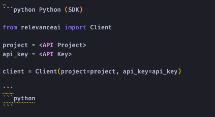

# ReadMe Markdown CheatSheet

ReadMe has it's own flavour of Markdown to render ReadMe specific components.

See official [docs](https://rdmd.readme.io/docs/getting-started) here for more details.


##  Code Blocks

Add an extra block to show tabbed blocks.
Add tab header next to language syntax.
To show tabbed code blocks, an extra empty code block needs be appended.


```python Python (SDK)
from relevanceai import show_json

show_json(
    results['results'], 
    image_fields=["product_image"], 
    text_fields=["product_title"]
)
```
```python
```



See official [docs](https://rdmd.readme.io/docs/callouts) here for more details.


## Callouts

Callouts are rendered by ReadMe's custom CSS depending on your emoji choice.

> 👍 Free for individual use. 100K free requests for commercial use.
> 
> Sign up for your free at https://cloud.relevance.ai/sdk/api, no credit card required! You can view our pricing here at https://relevance.ai/pricing.

eg. 


Default themes are specified using one of the following emojis. (If you don't like the one we've chosen, you can always switch to the alternate!)

|**Emoji**|**Class**|**Alternate**|
|:-----:|:-----:|:-----:|
|📘.| `.callout_info` |ℹ️ |
|👍	 | `.callout_okay` |  ✅ |
|🚧 | `.callout_warn` |  ⚠️ |
|❗️| `.callout_error` | 🛑 |


See official [docs](https://rdmd.readme.io/docs/callouts) here for more details.


##  Images

Images need to be wrapped in HTML `<figure>` and `<figcaption>` to show the caption below image.

```html
<figure>

<figcaption>Relevance AI dashboard</figcaption>
<figure>

```


