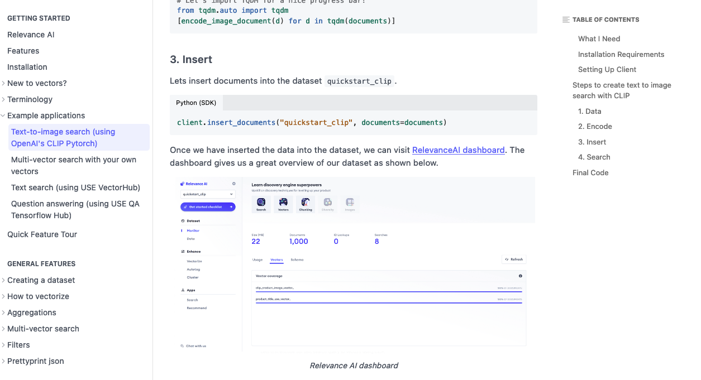

# ReadMe Markdown CheatSheet

ReadMe has it's own flavour of Markdown to render ReadMe specific components.

See official [docs](https://rdmd.readme.io/docs/getting-started) here for more details.


##  Code Blocks

Add an extra block to show tabbed blocks.
Add tab header next to language syntax.
To show tabbed code blocks, an extra empty code block needs be appended.


See official [docs](https://rdmd.readme.io/docs/callouts) here for more details.


##  Assets

Assets (images/gifs) need to be wrapped in HTML `<figure>` and `<figcaption>` to show the caption below image.

```html
<figure>

<figcaption>Relevance AI dashboard</figcaption>
<figure>

```




## Callouts

Callouts are rendered by ReadMe's custom CSS depending on your emoji choice.

```markdown
> 👍 Free for individual use. 100K free requests for commercial use.
> 
> Sign up for your free at https://cloud.relevance.ai/sdk/api, no credit card required! You can view our pricing here at https://relevance.ai/pricing.
```


Default themes are specified using one of the following emojis. (You can always switch to the alternate if preferred.)

|**Emoji**|**Class**|**Alternate**|
|:-----:|:-----:|:-----:|
|📘.| `.callout_info` |ℹ️ |
|👍	 | `.callout_okay` |  ✅ |
|🚧 | `.callout_warn` |  ⚠️ |
|❗️| `.callout_error` | 🛑 |


See official [docs](https://rdmd.readme.io/docs/callouts) here for more details.


## Tables 

Table cells may contain inline decorations only.

Lists, headings, and other block-level Markdown components are not valid and will cause errors.

```markdown
|**Schema Rule**|**Example**|
|:-----:|:-----:|
|When inserting or specifying chunks in a document the suffix (ends with) `_chunk_` for the field name. If you are unfamiliar with chunks, you can [read about them here Documents](doc:documents-1).| `products_chunk_`|
|When inserting or specifying chunk vectors in a document's chunks use the suffix (ends with) `_chunkvector_` for the field name.| `products_chunk_.product_description_chunkvector_`|
```


|**Schema Rule**|**Example**|
|:-----:|:-----:|
|When inserting or specifying chunks in a document the suffix (ends with) `_chunk_` for the field name. If you are unfamiliar with chunks, you can [read about them here Documents](doc:documents-1).| `products_chunk_`|
|When inserting or specifying chunk vectors in a document's chunks use the suffix (ends with) `_chunkvector_` for the field name.| `products_chunk_.product_description_chunkvector_`|

