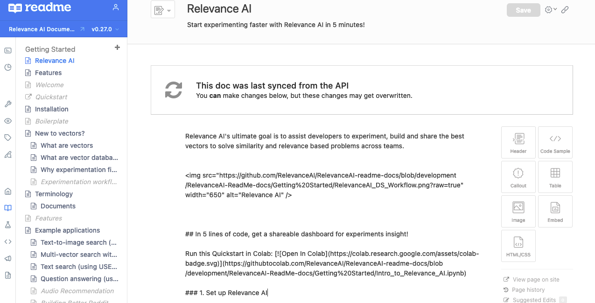

## 👩🏻‍💻 Getting Started with rdme Client

https://www.npmjs.com/package/rdme#docs


### Installation

```zsh
❯ npm install rdme
```

### Logging In

```zsh
❯ npx rdme login 
```

You will be prompted with your username and password. Once entered, you'll be able to select a project subdomain. Upon successful login, you will be greeted with this message: Successfully logged in as {user} to the {project-subdomain} project.

else export `$RELEVANCEAI_README_API_KEY` variable from ReadMe Project Configuration


```zsh
❯ export RELEVANCEAI_README_API_KEY='xxx'
```


### Syncing ReadMe docs

#### Syncing a Folder of Markdown Docs to ReadMe

Ensure folder structure matches the following - 





Make sure Front Matter in Markdown files - `title, slug, excerpt, hidden`

```markdown
---
title: "Relevance AI"
excerpt: "Start experimenting faster with Relevance AI in 5 minutes!"
slug: "welcome"
hidden: false
createdAt: "2022-01-10T01:31:01.336Z"
updatedAt: "2022-01-10T01:31:01.336Z"
---

```

```zsh
❯ npx rdme docs path-to-markdown-files --version={project-version} --key $RELEVANCEAI_README_API_KEY 

## eg.
❯ npx rdme docs ./docs/ --version=v0.27.0  --key $RELEVANCEAI_README_API_KEY
```

#### Edit a Single ReadMe Doc on Your Local Machine

```zsh
❯ npx rdme docs:edit <slug> --version={project-version}
```


#### Creating a New Version
##### Interactive

```zsh
❯ npx rdme versions:create <version> | --version={project-version}
```
##### Non-interactive

If you wish to automate the process of creating a new project version, and not have the CLI prompt you for input, you can do so by supplying the necessary flags to versions:create.

For example:

```zsh
❯ npx rdme versions:create <version> | --version={project-version} --fork={version-fork} --main={boolean} --beta={boolean} --isPublic={boolean}
```
